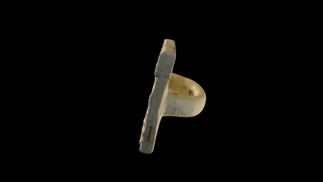

 

# A 3D model of a restored Akkadian brickstamp

Pottery stamp for bricks; restored; with modern impression; inscribed; 3 ll.

Length: 10.16 centimetres
Width: 6.5 centimetres
Thickness: 1.58 centimetres

Naram-Sin no. 10b. Commemorated the construction of a temple of Sin, the moon god by the ruler Naram-Sin.

Created from 88 photographs taken by Tess Sanders (with Google Pixel mobile phone), Jennifer Wexler and Terhi Nurmikko-Fuller

COL: http://www.britishmuseum.org/research/collection_online/collection_object_details.aspx?partId=1&objectId=368745

# LICENSE
The contents of this repository are licensed under CC-BY-NC-SA

# Credits
Photographs by Jennifer Wexler and Tess Sanders, (Project Manager - Gallery Digital), British Museum

Models by Daniel Pett <dpett@britishmuseum.org>, Digital Humanities Lead, British Museum
